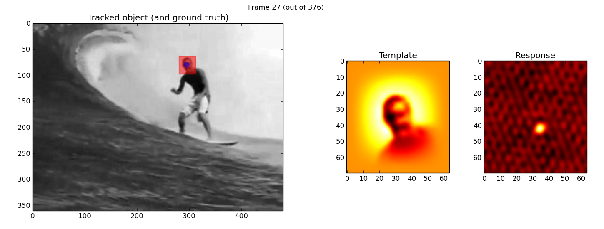

Circulant matrix tracker
========================

Python port of 
> "Exploiting the Circulant Structure of Tracking-by-detection with Kernels"
> João F. Henriques, Rui Caseiro, Pedro Martins, and Jorge Batista
> ECCV 2012

Find original matlab code and related publication at
http://www.isr.uc.pt/~henriques

To use this code:

1. Download and unzip some of the [MILTrack videos](http://vision.ucsd.edu/~bbabenko/project_miltrack.shtml) 
2. Run `./circulant_matrix_tracker.py -i path_to_folder_with_video_data`

Example: `./circulant_matrix_tracker.py -i /path_to_data/surfer/`

During execution drawing is the slowest part, if you close the drawing window, computation will significantly speed-up;
a result curve is show when reaching the end of the video.

Dependencies
============

* Python (used 2.7, might work with other versions too)
* Numpy
* Matplotlib
* Scipy

Bug reports
===========

Feel free to report bugs using github's issue tracker.
This port seems to work fine, but might still contain bugs.

[Rodrigo Benenson](http://rodrigob.github.io), MPI-Inf 2013

